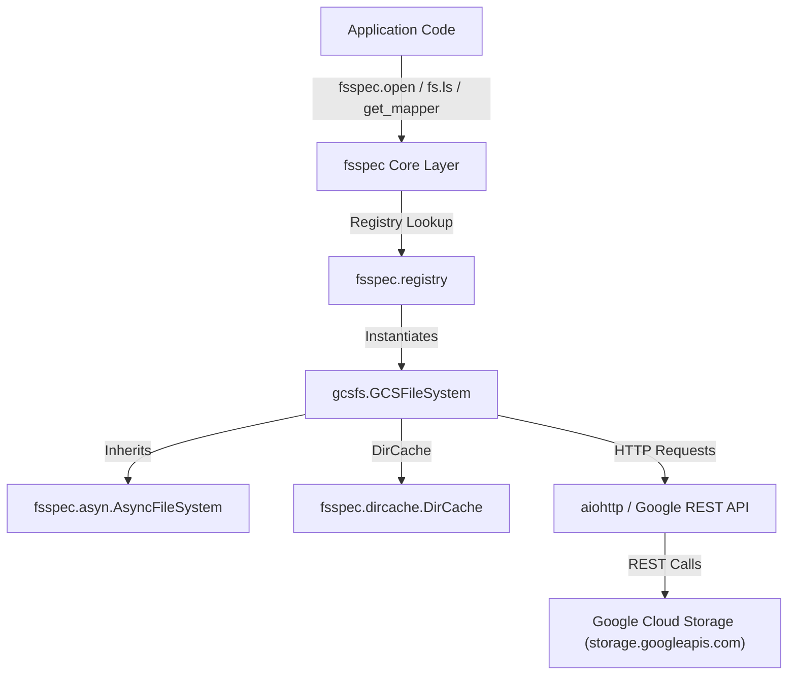
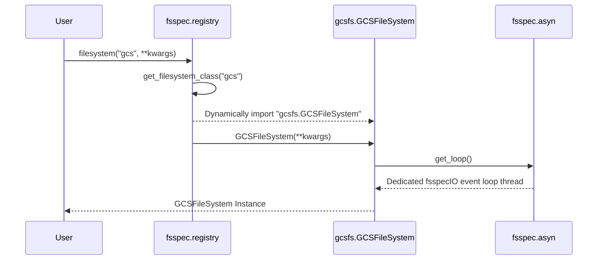
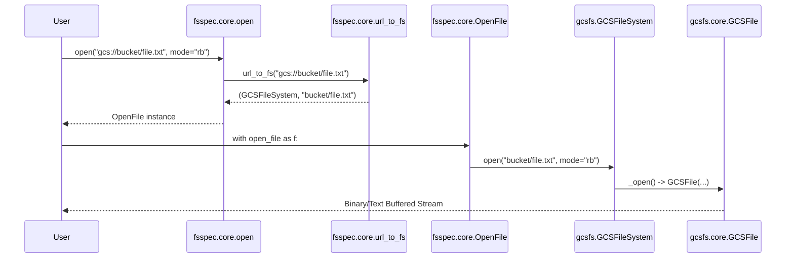
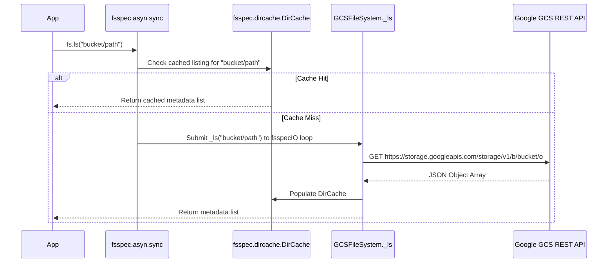

# fsspec Google Cloud Storage (`gcs://` / `gs://`) Interfaces & Code Flow Guide

This document provides a comprehensive technical reference for using Google Cloud Storage via `fsspec` (`filesystem_spec`). It details all exposed interfaces, practical code examples, and deep-dive code flows tracing execution through `fsspec` core and `gcsfs`.

---

## 1. Architecture Overview

`fsspec` provides a standardized filesystem interface across storage backends. For Google Cloud Storage (`gcs://` and `gs://`), `fsspec` delegates operations to `gcsfs.GCSFileSystem`.



---

## 2. All Exposed Interfaces in `fsspec` for GCS

`fsspec` exposes GCS through 5 primary categories of interfaces:

| Category | Function / Method | Description |
| :--- | :--- | :--- |
| **Instantiation & Registry** | [`fsspec.filesystem("gcs")`](file:///usr/local/google/home/princer/code/filesystem_spec/fsspec/registry.py#L17) | Creates a `GCSFileSystem` instance for protocol `"gcs"` or `"gs"`. |
| | [`fsspec.get_filesystem_class("gcs")`](file:///usr/local/google/home/princer/code/filesystem_spec/fsspec/registry.py#L7) | Returns the `GCSFileSystem` class without instantiating it. |
| | [`fsspec.core.url_to_fs(url)`](file:///usr/local/google/home/princer/code/filesystem_spec/fsspec/core.py#L386) | Parses a `gcs://` URL into `(fs_instance, path)`. |
| **Context & High-Level Open** | [`fsspec.open(url, mode, ...)`](file:///usr/local/google/home/princer/code/filesystem_spec/fsspec/core.py#L439) | Returns a lazy [`OpenFile`](file:///usr/local/google/home/princer/code/filesystem_spec/fsspec/core.py#L32) context manager for reading/writing. |
| | [`fsspec.open_files(urlpath, ...)`](file:///usr/local/google/home/princer/code/filesystem_spec/fsspec/core.py#L216) | Expands globs or lists of URLs into an [`OpenFiles`](file:///usr/local/google/home/princer/code/filesystem_spec/fsspec/core.py#L158) list. |
| | [`fsspec.open_local(url, ...)`](file:///usr/local/google/home/princer/code/filesystem_spec/fsspec/core.py#L528) | Downloads remote file (via caching layer) and yields local path. |
| **Key-Value Mapping** | [`fsspec.get_mapper(url)`](file:///usr/local/google/home/princer/code/filesystem_spec/fsspec/mapping.py#L6) | Wraps GCS bucket/prefix into a `MutableMapping` (dict-like). |
| **Chained Protocols & Cache** | `simplecache::gcs://...` | Caches read chunks or whole files to local disk. |
| | `zip::gcs://...`, `tar::gcs://...` | Mounts compressed archives stored directly on GCS. |
| **Direct FileSystem API** | `fs.cat()`, `fs.cat_file()`, `fs.cat_ranges()` | Reads file content directly into memory. |
| | `fs.pipe()`, `fs.pipe_file()`, `fs.touch()` | Writes bytes directly or creates empty files. |
| | `fs.open()` | Low-level file object instantiation (`GCSFile`). |
| | `fs.ls()`, `fs.info()`, `fs.exists()` | Listing, inspection, and metadata lookups. |
| | `fs.find()`, `fs.glob()`, `fs.walk()`, `fs.du()` | Search, glob pattern matching, and tree traversal. |
| | `fs.cp()`, `fs.mv()`, `fs.rm()`, `fs.mkdir()` | Copy, move, delete, and folder/bucket creation. |
| | `fs.get()`, `fs.put()` | Transfer files between local filesystem and GCS. |
| | `await fs._ls()`, `await fs._info()` | Asynchronous non-blocking coroutines. |

---

## 3. Application Program

An executable application demonstrating all these interfaces is available at:
[`test_gcs_all_interfaces.py`](file:///usr/local/google/home/princer/code/filesystem_spec/test_gcs_all_interfaces.py)

### Code Highlights

```python
import fsspec

# 1. High-Level File Open
with fsspec.open("gcs://bucket/file.txt", mode="rt") as f:
    print(f.readlines())

# 2. Key-Value Mapping
mapper = fsspec.get_mapper("gcs://bucket/kv_prefix")
mapper["key1"] = b"Sample Data"
print(mapper["key1"])

# 3. Direct FileSystem Methods
fs = fsspec.filesystem("gcs")
fs.pipe("bucket/data.txt", b"Hello GCS")
info = fs.info("bucket/data.txt")
items = fs.ls("bucket", detail=True)

# 4. Chained Protocol Caching
with fsspec.open("simplecache::gcs://bucket/data.txt", mode="rb") as f:
    print(f.read())
```

---

## 4. In-Depth Code Flows

### Scenario A: Registry Resolution (`fsspec.filesystem("gcs")`)



- **Entry Point**: [`fsspec.registry.filesystem("gcs")`](file:///usr/local/google/home/princer/code/filesystem_spec/fsspec/registry.py#L17)
- **Lookup**: Reads [`known_implementations["gcs"]`](file:///usr/local/google/home/princer/code/filesystem_spec/fsspec/registry.py#L123) -> `"gcsfs.GCSFileSystem"`.
- **Initialization**: Instantiates `GCSFileSystem` extending [`asyn.AsyncFileSystem`](file:///usr/local/google/home/princer/code/filesystem_spec/fsspec/asyn.py#L326). Starts background event loop `fsspecIO`.

---

### Scenario B: `fsspec.open("gcs://bucket/file.txt")`



- **Parsing**: [`url_to_fs()`](file:///usr/local/google/home/princer/code/filesystem_spec/fsspec/core.py#L386) splits protocol and path using `_un_chain()`.
- **Lazy Context**: Returns an [`OpenFile`](file:///usr/local/google/home/princer/code/filesystem_spec/fsspec/core.py#L32).
- **Execution**: Entering `with` calls `GCSFileSystem._open()` in [`gcsfs/core.py`](file:///usr/local/google/home/princer/code/filesystem_spec/venv/lib/python3.13/site-packages/gcsfs/core.py#L2182) and returns [`GCSFile`](file:///usr/local/google/home/princer/code/filesystem_spec/venv/lib/python3.13/site-packages/gcsfs/core.py#L2308).

---

### Scenario C: Sync-to-Async Bridge & Caching (`fs.ls()`, `fs.info()`)



- **Sync Bridge**: [`asyn.sync()`](file:///usr/local/google/home/princer/code/filesystem_spec/fsspec/asyn.py#L63) bridges synchronous caller to async event loop.
- **DirCache**: [`DirCache`](file:///usr/local/google/home/princer/code/filesystem_spec/fsspec/dircache.py#L6) provides O(1) in-memory metadata hits.
- **Network Call**: On cache miss, `_ls()` sends REST calls to Google Storage API via `aiohttp`.

---

## 5. Summary Table of Execution Flow

| Operation | Entry Function | Low-Level Dispatch | Network Protocol |
| :--- | :--- | :--- | :--- |
| `fsspec.open("gcs://...")` | [`fsspec.core.open`](file:///usr/local/google/home/princer/code/filesystem_spec/fsspec/core.py#L439) | `GCSFileSystem._open` -> `GCSFile` | Chunked HTTP GET / Resumable POST |
| `fsspec.open_files()` | [`fsspec.core.open_files`](file:///usr/local/google/home/princer/code/filesystem_spec/fsspec/core.py#L216) | `GCSFileSystem.glob` -> `find` | Object Prefix Listing |
| `fsspec.get_mapper()` | [`fsspec.get_mapper`](file:///usr/local/google/home/princer/code/filesystem_spec/fsspec/mapping.py#L6) | [`FSMap`](file:///usr/local/google/home/princer/code/filesystem_spec/fsspec/mapping.py#L13) wrapping `fs.cat`/`pipe` | HTTP GET / PUT |
| `fs.ls()` | `GCSFileSystem.ls` | `sync(loop, fs._ls)` | GCS JSON API `objects.list` |
| `fs.put()` / `fs.get()` | `GCSFileSystem.put/get` | [`_run_coros_in_chunks`](file:///usr/local/google/home/princer/code/filesystem_spec/fsspec/asyn.py#L220) | Concurrent Async Chunk Transfers |
